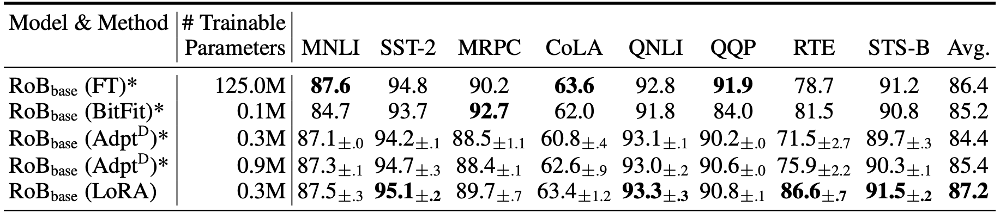

# CS 4782 Final Project: LoRA Re-Implementation

## 1) Introduction

Re-implementation of **LoRA: Low-Rank Adaptation of Large Language Models** (Hu et al., 2021) for CS 4782.  
LoRA injects trainable low-rank matrices into frozen pretrained weights, enabling parameter-efficient fine-tuning.

## 2) Chosen Result

We reproduce Table 2 of the paper: LoRA on RoBERTa-base accuracy versus full fine-tuning accuracy on SST-2, QNLI, and RTE.


## 3) GitHub Contents

- `code/` — re-implementation source and training scripts
- `data/` — dataset instructions (auto-downloaded via HuggingFace)
- `results/` — per-run `results.json` logs
- `poster/`, `report/` — final poster and 2-page report PDFs
- `public/` - static project assets (paper PDF and reference figures/tables)

## 4) Re-implementation Details

We fine-tune pretrained `roberta-base` using a custom LoRA implementation that injects trainable rank-r matrices into the Q and V projections of every self-attention block, with all base weights frozen. We train LoRA fine-tuning using rank = 8 and a full fine-tuning baseline while tracking training/validation accuracy, trainable parameter count, epoch time, and peak GPU memory.

## 5) Reproduction Steps

```bash
python -m venv venv
source venv/bin/activate
pip install -r code/requirements.txt

# Example training run scripts (LoRA or full fine-tuning)
python code/run_experiment.py --task sst2 --mode lora --rank 8 --seed 42
python code/run_experiment.py --task rte --mode full --seed 42
```

`run_experiment.py` parameters:

- `--task` (required): `sst2`, `qnli`, or `rte`
- `--mode` (required): `lora` or `full`
- `--rank` (optional, default `8`): LoRA rank `r` (ignored when `--mode full`)
- `--alpha` (optional, default `8` for LoRA): LoRA scaling alpha
- `--seed` (optional, default `42`): random seed for reproducibility
- `--output_dir` (optional): output directory for `results.json`
  - default for LoRA: `results/{task}_lora_r{rank}`
  - default for full fine-tuning: `results/{task}_full`
- `--verify` (optional flag): run LoRA sanity checks before training

## 6) Results / Insights

Our RoBERTa-base results on the three reproduced tasks are:

- **SST-2**: LoRA `94.38` vs paper LoRA `95.1`; Full FT `93.69` vs paper Full FT `94.8`
- **QNLI**: LoRA `92.81` vs paper LoRA `93.3`; Full FT `92.90` vs paper Full FT `92.8`
- **RTE**: LoRA `80.14` vs paper LoRA `86.6`; Full FT `79.42` vs paper Full FT `78.7`

LoRA remains much more parameter-efficient in our runs: `887,042` trainable parameters vs `124,647,170` for full fine-tuning (~`0.71%` as many trainable parameters).

## 7) Conclusion

Our re-implementation confirms LoRA's core claim that low-rank adapters achieve accuracy equal to or better than fine-tuning quality at a fraction of the parameter and memory cost.

## 8) References

- Hu, E. J., Shen, Y., Wallis, P., Allen-Zhu, Z., Li, Y., Wang, L., Wang, W., and Chen, W. (2021). _LoRA: Low-Rank Adaptation of Large Language Models_. arXiv:2106.09685.
- PyTorch: https://docs.pytorch.org/docs/stable/index.html

## 9) Acknowledgements

Completed as part of Cornell CS 4782. Thanks to course staff and peers for feedback.
